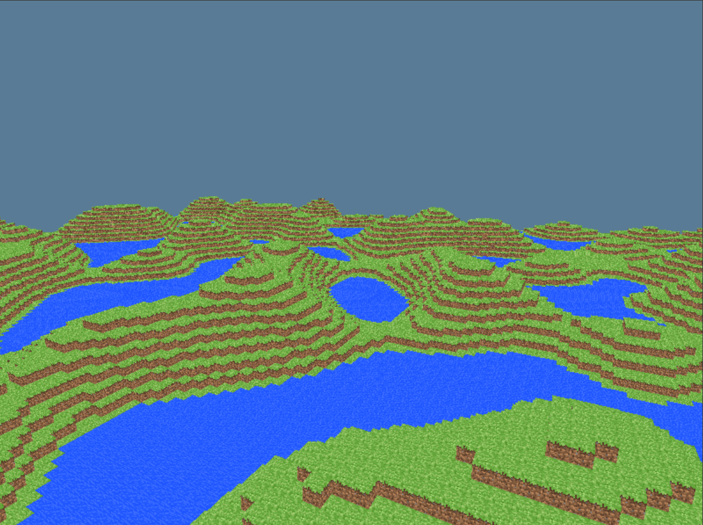

# Wgpu Minecraft Clone

## Why another minecraft clone?

There will never be enough minecraft clones out there! if i really consider myself a game developer even as a hobbyist (for now), a minecraft clone is a must step i have to take!

## What's different about this minecraft clone?

Im not using any game engine, instead im using a pure graphics library (wgpu) and the rust programming language.

I have seen a couple similar minecraft clones but are pretty basic, in general my objective with this repo is to create a playable minecraft clone similar to this one:  
https://github.com/jdah/minecraft-weekend   
 but as i mentioned, using wgpu and rust.

## why not using a game engine?

Because i'm too cool for that, i like to struggle, and that keeps my mind busy, so i decided that a making game from scratch using a pure graphics library would be a great pain to experience.

## Screenshots

## Roadmap

### What has been done ?

* atlas texture
* block rendering
* face culling (only visible block faces are rendered)
* fps controller 
* basic chunk generation

### Work in progress...

* optimize chunk system
* chunk culling (similar to face culling but considering chunk neighbors)
* terrain generation based on noise map 

### future features

* greddy mesh algorithm
* block manipulation
* ECS (Entity Component System)
* HUD elements